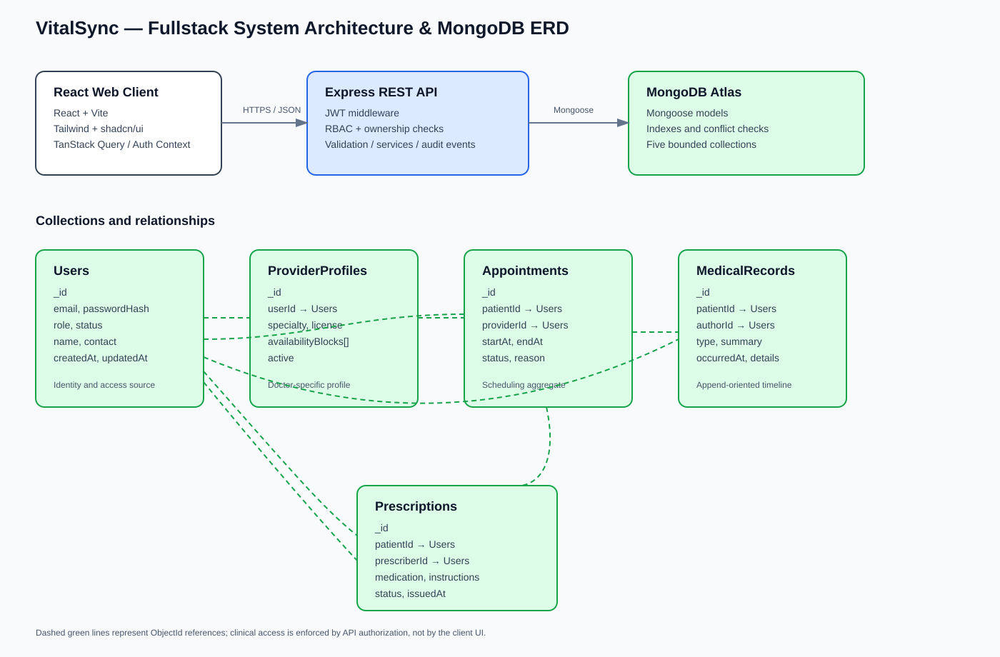

# VitalSync

> A commercial-grade Electronic Health Record (EHR) and hospital management dashboard designed for secure coordination between patients, doctors, and healthcare operations teams.

## 1. Product Overview

VitalSync centralizes appointment scheduling, patient medical histories, prescriptions, and provider availability in one role-aware web application. The MVP focuses on a reliable workflow for patients to request care, doctors to review clinical context, and administrators to coordinate operational capacity.

### Problem Statement

Healthcare teams often work across disconnected scheduling, medical-record, and prescription workflows. This creates duplicate data entry, delayed updates, and poor visibility into the patient journey. VitalSync provides a unified dashboard with clear role boundaries and auditable state changes.

### Product Goals

- Make appointment discovery and booking understandable for patients.
- Give doctors a concise view of relevant patient history before an appointment.
- Keep prescription status and appointment status visible to authorized users.
- Demonstrate secure role-based access control and predictable data ownership.
- Deliver a responsive interface for desktop, tablet, and mobile workflows.

### Non-Goals for the MVP

The first release will not include video consultations, insurance claims processing, medical-device integrations, AI diagnosis, pharmacy fulfillment, or emergency dispatch. These are deliberately deferred to prevent scope creep.

## 2. Designated Track

**Fullstack Engineering**

The implementation will include a React client, Express API, MongoDB persistence, authentication, authorization, validation, and deployment configuration. The planning phase is intentionally limited to product requirements, UI/UX specifications, and system architecture.

## 3. Proposed Technology Stack

| Layer | Technology | Purpose |
|---|---|---|
| Frontend | React + Vite | Responsive single-page dashboard |
| Styling | Tailwind CSS | Utility-first responsive styling |
| Components | shadcn/ui + Radix UI | Accessible, composable UI primitives |
| Routing | React Router | Role-aware application routes |
| Server | Node.js + Express | REST API and business rules |
| Database | MongoDB + Mongoose | Document persistence and relationships |
| Authentication | JWT access tokens + bcrypt | Session identity and password security |
| Validation | Zod or express-validator | Request and payload validation |
| Client state | TanStack Query + lightweight auth context | Server cache and session state |
| Forms | React Hook Form | Controlled form handling |
| Drag/interaction | Native pointer interactions or dnd-kit where needed | Calendar and operational interactions |
| Testing | Vitest, React Testing Library, Supertest | Unit, component, and API tests |
| API documentation | OpenAPI/Swagger | Contract documentation |
| Deployment | Vercel frontend + Render/Railway API + MongoDB Atlas | Production hosting |
| CI/CD | GitHub Actions | Lint, test, build, and deployment checks |

## 4. Personas and Roles

### Patient

- Browse available providers and specialties.
- Request, reschedule, and cancel appointments according to policy.
- View personal medical history and prescription status.
- Update limited profile and contact information.

### Doctor

- View assigned appointments and availability.
- Review authorized patient history and timeline entries.
- Add clinical notes and prescriptions for completed consultations.
- Mark appointment outcomes and follow-up requirements.

### Administrator

- Manage users, provider profiles, specialties, and availability blocks.
- View operational appointment metrics.
- Resolve scheduling conflicts and deactivate accounts.
- Audit sensitive record activity without editing clinical content by default.

## 5. Prioritized Core Features

### P0 — MVP Critical

1. Secure registration and login with role-specific access.
2. Patient, doctor, and administrator dashboards.
3. Provider directory with specialty and availability filters.
4. Appointment booking, confirmation, rescheduling, and cancellation states.
5. Doctor availability management.
6. Patient medical-history timeline.
7. Prescription creation and status viewing.
8. API validation, authorization middleware, and ownership checks.
9. Responsive layouts for mobile and desktop.

### P1 — Required for Full Feature Completion

1. Appointment conflict detection and optimistic UI feedback.
2. Search and filtering across patients, providers, and appointments.
3. Pagination and empty/loading/error states.
4. Activity/audit feed for sensitive operational actions.
5. Notification center for appointment and prescription updates.
6. Soft deactivation for users and providers.
7. OpenAPI documentation and automated API tests.

### P2 — Stretch / Sprint 16 Enhancements

1. Email notification integration.
2. Calendar export support.
3. Dashboard analytics for appointment volume and no-show rate.
4. Accessibility audit and keyboard-first improvements.
5. Optional payment or billing integration after MVP stability.

## 6. Application Routes

| Route | Access | Purpose |
|---|---|---|
| `/login` | Public | Sign in |
| `/register` | Public | Patient registration |
| `/dashboard` | Authenticated | Role-specific overview |
| `/appointments` | Authenticated | Appointment list and filters |
| `/appointments/new` | Patient | Book an appointment |
| `/appointments/:id` | Authorized user | Appointment details and state transitions |
| `/providers` | Authenticated | Provider directory |
| `/providers/:id` | Authenticated | Provider profile and availability |
| `/patients/:id/timeline` | Doctor/Admin/Owner | Medical-history timeline |
| `/prescriptions` | Patient/Doctor | Prescription list and status |
| `/admin/users` | Admin | User and role management |
| `/admin/audit-log` | Admin | Audit activity |

## 7. REST API Blueprint

### Authentication

- `POST /api/auth/register`
- `POST /api/auth/login`
- `GET /api/auth/me`
- `POST /api/auth/logout`

### Users and Providers

- `GET /api/users/me`
- `PATCH /api/users/me`
- `GET /api/providers`
- `GET /api/providers/:providerId`
- `PATCH /api/providers/:providerId/availability` — Doctor/Admin

### Appointments

- `GET /api/appointments`
- `POST /api/appointments`
- `GET /api/appointments/:appointmentId`
- `PATCH /api/appointments/:appointmentId/status`
- `PATCH /api/appointments/:appointmentId/reschedule`
- `DELETE /api/appointments/:appointmentId` — soft cancellation

### Medical Records and Prescriptions

- `GET /api/patients/:patientId/timeline`
- `POST /api/patients/:patientId/timeline` — Doctor
- `GET /api/patients/:patientId/prescriptions`
- `POST /api/patients/:patientId/prescriptions` — Doctor
- `PATCH /api/prescriptions/:prescriptionId/status`

### Administration

- `GET /api/admin/users`
- `PATCH /api/admin/users/:userId/status`
- `GET /api/admin/audit-log`

All protected endpoints require authentication. Authorization middleware will enforce role permissions and resource ownership. Sensitive medical endpoints will never rely on a client-provided role alone.

## 8. Data Model Summary

VitalSync will use five primary MongoDB collections, which fits the capstone requirement while keeping the MVP manageable:

1. **Users** — identity, role, contact details, account status.
2. **ProviderProfiles** — doctor specialty, license metadata, availability configuration.
3. **Appointments** — patient/provider relationship, time slot, status, reason, audit timestamps.
4. **MedicalRecords** — timeline entries, diagnosis notes, attachments metadata, author.
5. **Prescriptions** — medication instructions, prescribing doctor, patient, lifecycle status.

References use MongoDB `ObjectId` values. Clinical records are append-oriented where practical; updates are restricted and auditable.

## 9. Security and Privacy Requirements

- Store passwords only as bcrypt hashes.
- Use short-lived access tokens and secure refresh/session strategy before production launch.
- Enforce server-side role-based access control on every protected resource.
- Apply ownership checks to patient records and prescriptions.
- Validate and sanitize all request payloads.
- Avoid logging passwords, tokens, clinical notes, or unnecessary personally identifiable information.
- Add rate limiting to authentication and sensitive endpoints.
- Use HTTPS in deployed environments and environment variables for secrets.
- Include audit events for login, record access, appointment changes, and prescription changes.
- Treat the capstone as demonstration software, not a HIPAA-certified production system.

## 10. UI/UX Wireframe Plan

The Figma file will contain responsive wireframes for at least these viewports:

1. **Authentication screen** — login, registration, validation, password visibility, and responsive mobile arrangement.
2. **Patient dashboard** — upcoming appointment card, provider search, prescription status, timeline preview, and mobile bottom navigation.
3. **Doctor dashboard** — schedule view, patient queue, availability controls, and quick actions.
4. **Appointment details** — status stepper, participants, reason, reschedule/cancel actions, and activity history.
5. **Patient timeline/details** — chronological records, prescription panel, privacy-aware empty states, and responsive data cards.

### Figma Design Link

**To be replaced with the public Figma file URL:** `FIGMA_LINK_PENDING`

The wireframe specification is documented in [`docs/wireframes.md`](docs/wireframes.md). The final Figma file must be set to public or “anyone with the link can view” before submission.

## 11. Delivery Roadmap

### Sprint 13 — Blueprint

- Lock PRD and MVP scope.
- Complete Figma wireframes.
- Finalize ERD, API contracts, and security assumptions.
- Identify implementation risks and research questions.

### Sprint 14 — MVP Build

- Initialize frontend, API, and database layers.
- Implement authentication and role guards.
- Build dashboards, provider directory, and appointment CRUD.
- Add responsive states and test fixtures.

### Sprint 15 — Feature Completion

- Implement medical timeline and prescription workflows.
- Add provider availability and conflict detection.
- Add administrator controls, audit activity, filtering, and pagination.
- Complete API and component test coverage.

### Sprint 16 — AI Integration and UX Polish

- Evaluate only low-risk assistive features, such as appointment-summary drafting with explicit human review.
- Improve accessibility, loading states, error recovery, and visual consistency.
- Add optional notifications or calendar export.

### Sprint 17 — Deployment and Go-Live

- Configure production environment variables and database indexes.
- Run security, accessibility, and smoke-test checklists.
- Configure CI/CD and deploy frontend/API.
- Record the three-minute QA demonstration and submit URLs.

## 12. Risks and Mitigations

| Risk | Mitigation |
|---|---|
| Healthcare scope becomes too broad | Keep MVP to scheduling, records timeline, prescriptions, and roles |
| Incorrect authorization exposes records | Centralize middleware and add negative authorization tests |
| Appointment race conditions | Validate slot availability server-side and use unique conflict checks |
| Complex medical forms slow delivery | Use structured, minimal fields and defer rich attachments |
| Production privacy expectations exceed capstone scope | Clearly label demo limitations and avoid real patient data |
| Figma link is unavailable at submission | Complete wireframes early and verify public sharing settings |

## 13. Definition of Done for Blueprint Submission

- [x] Public repository created.
- [x] PRD and prioritized feature scope documented.
- [x] Fullstack technology stack selected.
- [x] Five-collection data model planned.
- [x] REST endpoint contract drafted.
- [x] Architecture/ERD diagram embedded.
- [ ] Public Figma URL inserted in place of `https://www.figma.com/design/PralBDxLJIJji3gLhrnZ4J/Untitled?t=h1RPR4WgQWJkSLGi-1`.
- [x] AI planning questions recorded in [`Prompts.md`](Prompts.md).

## 14. Submission Links

- **GitHub repository:** https://github.com/vivekk-rajj/prodesk-capstone-vitalsync
- **Figma:** `FIGMA_LINK_PENDING`
- **Demo video:** `DEMO_VIDEO_LINK_PENDING`
